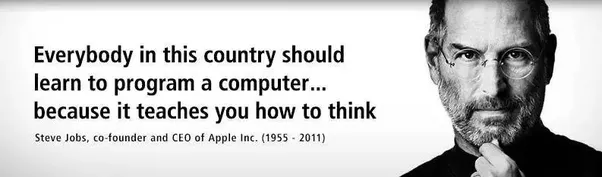
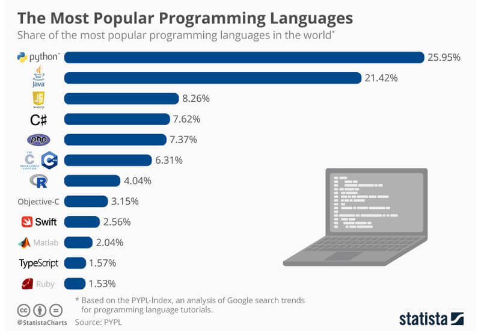
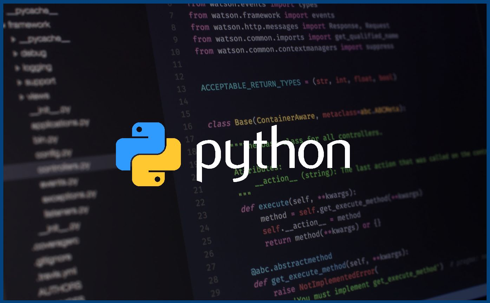

# Python-course

# What Is Programming Language?

Before looking at programming language let's just remind what **Language** is?
**Language** is simply a medium of communication between us _humans_. Similarly a **Programming Language** is a medium of communication between _humans_ and _computers_.
Computers understand only **0's** and **1's** which is called `Machine Level Language`. we humans don't understand it so we have developed some languages which will work as translator between us and computers and those languages are `Programming Languages`.

# Why to Learn Programming?

**Programming** is not for Software Engineers only, it is for `EVERYONE`. It is not about landing job in IT field. It is about improving our problem solving skills and logical thinking. **Programming** does improve the way we look at problems in our lives. Thus everyone should learn Programming.

# Why Python?

As shown in the chart above, **python** is the most famous programmming language and it is also one of the easiest language for beginners. Python has so many _pre-defined libraries_ to help beginners find their way in solving problems. There is no doubt that python is one of the best language to learn and to master.

# Let's Get Started...

# Basics

Before taking a deep dive into python we shall discuss some of the basic concepts that are necessary for learning any programming language.

**1. Data**

`What is data?` This is the most important question every programmer should know the answer of. Data are characteristics or information, usually numerical, that are collected through observation. In a Nutshell, **Data is nothing but all the information around us**.

**2. Operations**

There are 3 types of Operations used in programming.

- Arithmetic Operations
- Relational Operations
- Logical Operations

**a. Arithmetic Operations**
There are 7 Arithmetic Operations.

|   Operators   |      Name       |                         Operation                            |
| ------------- | --------------- | ------------------------------------------------------------ |
|       +       |   Addition      |  Adds two Operands                                           |
|       -       |  Subtraction    |  Subtracts two Operands                                      |
|       *       | Multiplication  |  Multiplies two Operands                                     |
|       /       | Division(float) |  Divides first Operand by second                             |
|      //       | Division(floor) |  Divides first Oprands by second                             |
|      %        |     Modulus     |  Returns remainder when first operand is divided by second   |
|      **       |      Power      |  Returns nth power of an Operand                             |

**b. Relational Operations**
There are 6 Relational Operations as well.

|   Operators   |      Name       |                         Operation                            |
| ------------- | --------------- | ------------------------------------------------------------ |
|       ==      |   Equal         |  Returns true if two operands are equal                                           |
|       !=      |  Not Equal      |  Returns true if two operands are not equal                                      |
|       >       | Greater Than    |  Returns true if first operand is greater than second                                     |
|       <       | Less Than       |  Returns true if first operand is less than second                              |
|      >=       | Greater or Equal|  Returns true if first operand is greater than or equal to second                             |
|      <=       |    Less or Equal|  Returns true if first operand is less than or equal to second   |

