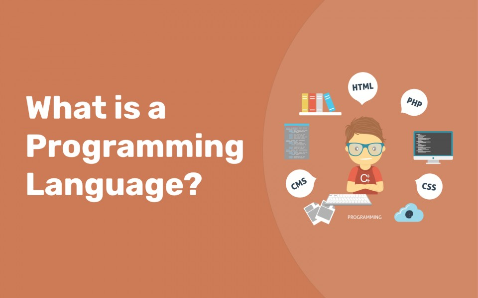

# Python-course
# What Is Programming Language?

Before looking at programming language let's just remind what __Language__ is?
__Language__ is simply a medium of communication between us _humans_. Similarly a __Programming Language__ is a medium of communication between _humans_ and _computers_.
Computers understand only __0's__ and __1's__ which is called `Machine Level Language`. we humans don't understand it so we have developed some languages which will work as translator between us and computers and those languages are `Programming Languages`.

# Why to Learn Programming?

__Programming__ is not for Software Engineers only, it is for `EVERYONE`. It is not about landing job in IT field. It is about improving our problem solving skills and logical thinking. __Programming__ does improve the way we look at problems in our lives. Thus everyone should learn Programming.

# Why Python?

